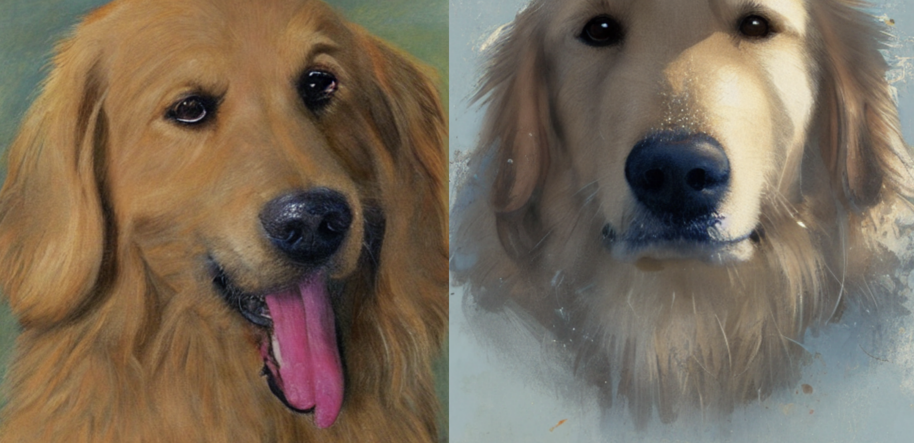
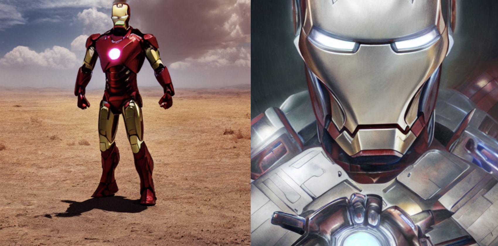
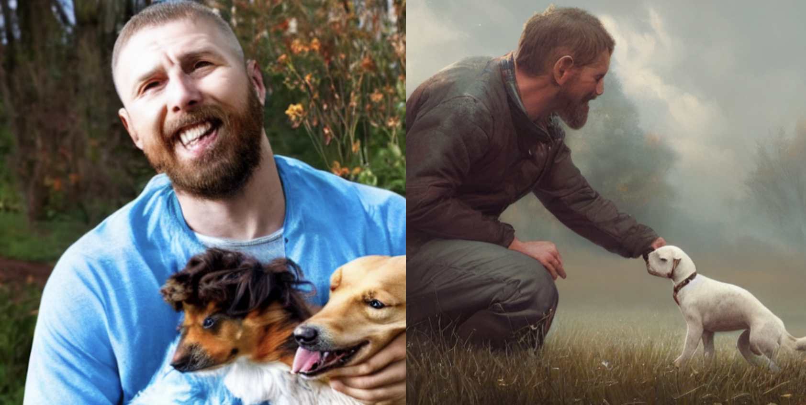

automatic prompt generation for stable diffusion
=======
# Introduction

This project is to help users better use text-to-image models such as Stable Diffusion. When users would like to generate some objects or certain landscapes, but the input prompts are too simple, resulting in relatively low quality output images and relatively monotonous content, this project is finetune GPT-2 on DiffusionDB for to realize the mapping of users' simple prompts to complex prompts.


**Author** 

| Name | RUC Email | GitHub Username |
| ---- | --------- | --------------- |
|  Hanzhong Guo    |  2022100402@ruc.edu.cn   |   Guohanzhong         |


## Installing / Getting started

A quick introduction of the minimal setup you need to get the app up & running.

```shell
git clone https://github.com/Guohanzhong/automatic-prompt-generation-for-diffusion-model.git
cd automatic-prompt-generation-for-diffusion-model

# Install all the dependencies for the frontend
pip install -r requirements.txt
```

## Finetune GPT-2

Once the datasets are set up, you can finetune your own GPT-2 networks as follows:

The basic usage for training is
```sh
python run_clm.py --model_name_or_path gpt2   --train_file path/dataset  --per_device_train_batch_size per_device_train_batch_size --per_device_eval_batch_size per_device_eval_batch_size --do_train --do_eval --output_dir path/output --overwrite_output_dir True
```
* `model_name_or_path` is the path to for basic model to finetune.
* `train_file` is the dataset we use to finetune the model, it is recommond to use the diffusiondb.txt to finetune (More about this data is in the section "Database")
* `per_device_train_batch_size` is train batch size per device, we would construct each samples use the frame of pretrained-data frame.

What's more, it is required to login [wandb](https://wandb.ai), enter the following in the command line and enter your key in the [wandb](https://wandb.ai).
```sh
wandb login --relogin
```
By default, `train.py` is configured to train the GPT-2 for the DiffusionDB dataset at 58000 iterations using 1 GPUs. 

Expected training times for the default configuration using Tesla V100 GPUs:

| GPUs | 58000 iterations;  | 100000 iterations;   |
| :--- | :--------------  | :------------    | 
| 1    | 8 hours  | 11 hours | 
| 2    | 6 hours | 9 hours  |
| 4    | 4 hours  | 7 hours   |

After Finetune, the basic use for inference is 
```sh
python inference.py --pre_path pretrained_path --ini_query str
```
* `pre_path` is the pretrained model path to load.
* `ini_query` is the query input for generating a detailed prompt.

And you could obtain the checkpoint in the following link. [Links](https://drive.google.com/file/d/15OhhKgazTK4KP8Wr_tP78UftcRgM756o/view?usp=share_link)
## Database

Our dataset is DIFFUSIONDB. DIFFUSIONDB is the first large-scale dataset containing 14 million Stable Diffusion images and their text prompts and hyperparameters. This dataset provides exciting research opportunities in prompt en- gineering, deepfake detection, as well as understanding and debugging large text-to-image generative models and its github is [DiffusionDB](https://poloclub.github.io/diffusiondb)

Before the finetune model, we need to prepare the dataset of DiffusionDB, and we only need its text data at this stage, with a total of two million text data. The data format of the text data is shown below, each piece of data is a detailed user-written prompt, and this prompt can produce high-quality images.
```shell
<BOS> doom eternal, game concept art, veins and worms, muscular, crustacean exoskeleton, chiroptera head, chiroptera ears, mecha, ferocious, fierce, hyperrealism, fine details, artstation, cgsociety, zbrush, no background <EOS> 
```
The data can be obtained as follows.
[DiffusionDB.txt](https://drive.google.com/file/d/15OhhKgazTK4KP8Wr_tP78UftcRgM756o/view?usp=share_link)

## Results
```shell
Input: portrait of a golden retriever
Output: portrait of a golden retriever  in the style of tom bagshaw, norman rockwell, zdzislaw beksinski, lewis jones, dariusz zawadzki, wayne barlow, warhammer fantasy, cold hue's, warm tone gradient background, concept art, 4 k, ultra - high - definition
```


```shell
Input: a picture of iron man
Output: a picture of iron man, close up, fantasy, intricate, elegant, highly detailed, digital painting, artstation, concept art, smooth, sharp focus, illustration, art by artgerm and greg rutkowski and alphonse mucha
```


```shell
Input: a picture of a man and a dog
Output: a picture of a man and a dog kissing in a field, digital art, trending on artstation, concept art, award - winning, hyper detailed, ultra realistic, sharp, 4 k, 8 k, art by greg rutkowski
```

